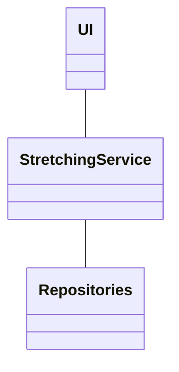
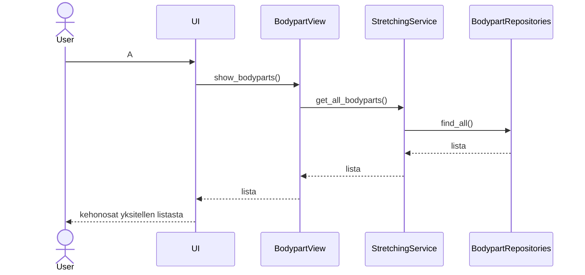

## Luokkakaavio

```mermaid
classDiagram
  UI -- StretchingService
  StretchingService -- Repositories
```

## Sekvenssikaavio

Sekvenssikaavio näyttää kuinka käyttäjä saa listan kehonosista.

```mermaid
sequenceDiagram
actor User
User ->> UI: A
UI ->> BodypartView: show_bodyparts()
BodypartView ->> StretchingService: get_all_bodyparts()
StretchingService ->> BodypartRepositories: find_all()
BodypartRepositories -->> StretchingService: lista
StretchingService -->> BodypartView: lista
BodypartView -->> UI: lista
UI -->> User: kehonosat yksitellen listasta
```

