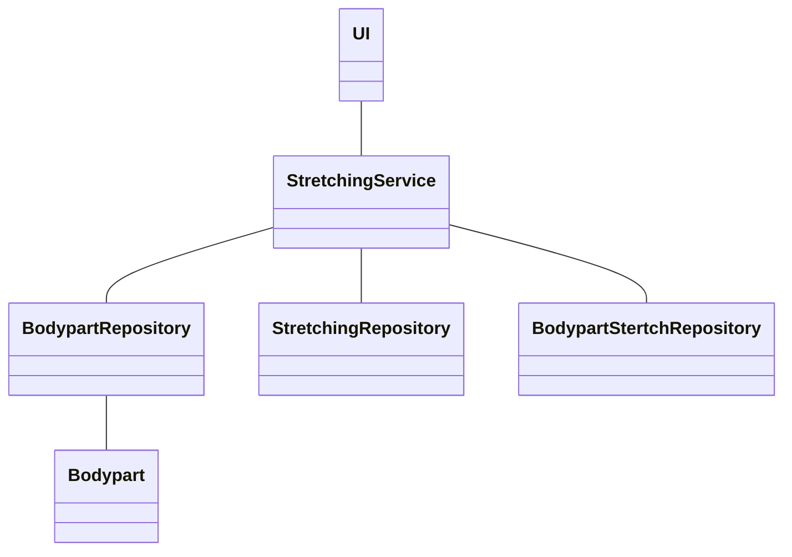
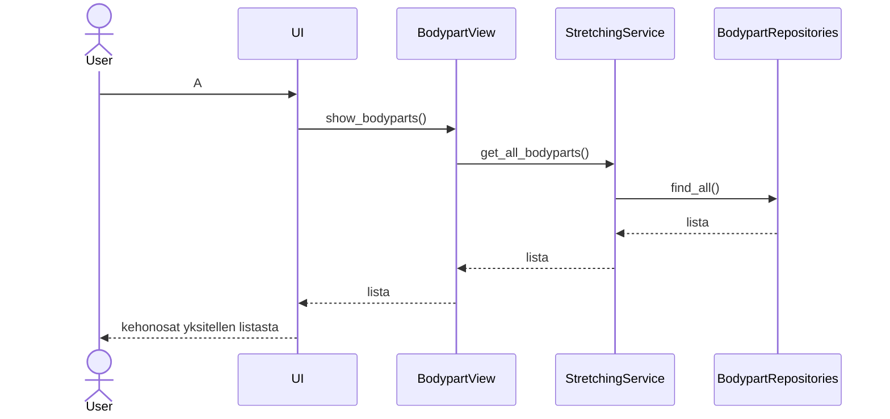

# Arkkitehtuurikuvaus

## Rakenne

Ohjelma käynnistetetään index.py-moduulissa, joka luo graafisen käyttöliittymän pohjan, ja ohjaa seuraavat käskyt ui-hakemistolle. Ui-hakemisto sisältää käyttöliittymän eri näkymiin tarvittavat luokat.

Luokat ohjaavat käskynsä services-hakemistossa sijaitsevalle StretchingServices -luokalle. Tämä luokka käyttää repositories-hakemistossa olevia Reporitory-luokkien (esim. BodypartRepository) tiedontallennusta ja -hakemista varten laadittuja funkitoita.

Tämän lisäksi kehonosista tehdään myös oma olionsa entities-hakemiston Bodypart-luokassa.

Tiedontallennus ja haku tapahtuu sekä SQLite-tietokantaa että CSV-tiedostoja käyttäen.

## Luokkakaavio

## Sekvenssikaavio

Sekvenssikaavio näyttää kuinka käyttäjä saa listan kehonosista.

# Ohjelman rakenteen heikkoudet

En ole aivan vakuuttunut entities.hakemiston Bodypart-olion hyödyllisyydestä sovelluksen tämän hetkisessä versiossa.

