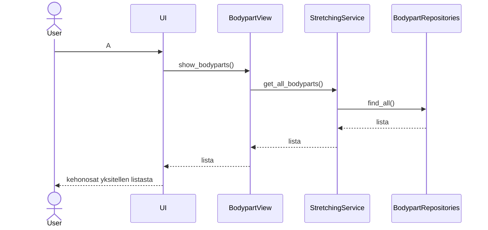

# Arkkitehtuurikuvaus

## Rakenne

Ohjelma käynnistetetään index.py-moduulissa, joka luo graafisen käyttöliittymän pohjan, ja ohjaa seuraavat käskyt ui-hakemistolle. Ui-hakemisto sisältää käyttöliittymän eri näkymiin tarvittavat luokat.

Luokat ohjaavat käskynsä services-hakemistossa sijaitsevalle StretchingServices -luokalle. Tämä luokka käyttää repositories-hakemistossa olevia Reporitory-luokkien (esim. BodypartRepository) tiedontallennusta ja -hakemista varten laadittuja funkitoita.

Tämän lisäksi kehonosista tehdään myös oma olionsa entities-hakemiston Bodypart-luokassa.

Tiedontallennus ja haku tapahtuu sekä SQLite-tietokantaa että CSV-tiedostoja käyttäen.

## Pakkauskaavio

## Käyttöliittymä

Käyttöliittymä koostuu kahdeksasta eri näkymästä. Näkymiä on erikseen sekä ylläpitäjälle että tavalliselle käyttäjälle. 
Näkymät ovat:
1. Aloitusnäkymä, josta voi siirtyä rekisteröitymään tai kirjautumaan sisään.
2. Rekisteröitymisnäkymä.
3. Kirjautumisnäkymä.
4. (Normikäyttäjä) Lista kehonosista, hakukenttä venytyksille, kirjaudu ulos -painike.
5. (Ylläpitäjä) Lista kehonosista, hakukenttä venytyksille, kirjaudu ulos -painike, ylläpitäjän toiminnallisuudet painike.
6. (Normikäyttäjä) Lista venytyksistä tietylle kehonosalle, josta pääsee takaisin 4. näkymään.
7. (Ylläpitäjä) Lista venytyksistä tietylle kehonosalle, josta pääsee takaisin 5.näkymään.
8. (Ylläpitäjä) Venytyksen lisäämisemahdollisuus.

Näkymät sijaitsevat ui-hakemistossa.

## Sovelluslogiikka

Sovelluksen olennaiset tietomallit rakentuvat kehonosista-palasista ja niihin liittyvistä venytysten nimistä ja ohjeista. Nämä kaikki on tallennettu .csv-tiedostoihin ja tietokantaa. Bodyparts.csv -tiedostossa on tallennettuna samalla rivillä sekä kehonosa että kaikkien venytysten nimet, jotka siihen kuuluu.

StretchingServices luokka teettää repositories-hakemistossa sijaitsevilla erinäisillä Repository-luokilla tiedon tallennukseen ja hakuun liittyviä tehtäviä. Näihin kuuluu mm. kehonosien ja venyttelyohjeiden lisääminen tietokantaan ja .csv-tiedostoihin, niiden hakeminen tietokannasta ja käyttäjätietojen tallentamiseen liittyvät operaatiot.

### Tiedon tallennus

bodyparts.csv-tiedostoon tallennetaan kehonosan ja siihen liittyvän venytyksen nimi.
stretches.csv-tiedostoon tallennetaan venytyksen nimi ja sen ohjeet. 

Tietokantataulut alustetaan seuraavanlaisesti.
Bodyparts (id INTEGER PRIMARY KEY, name TEXT UNIQUE)
Stretches (id INTEGER PRIMARY KEY, name TEXT UNIQUE, description TEXT UNIQUE)
BodypartStretches (id INTEGER PRIMARY KEY, bodypart_id INTEGER REFERENCES Bodyparts, stretch_id INTEGER REFERENCES Stretches)

Bodyparts-taulussa jokaisella kehonosalla on id ja uniikki nimi. Stretches-taulussa venytyksillä on id, uniikki nimi ja uniikki kuvaus. Uniikeilla nimillä ja kuvauksilla varmistetaan se, että tietokantaa hyödyntävät operaatiot valitsevat aina halutun kohteen. BodypartStretches-taulussa yhdistetään toisiinsa sopivat kehonosat ja venytykset laittamalla saman id:n alle Bodyparts-taulussa kehonsaan viittavan id:n ja Stretches-taulussa olevaan venytykseen liittyvän id-tunnuksen.

Sovellus toimisi tällä hetkellä myös ilman .csv-tiedostoja. Ne on lähinnä "tulevaisuutta" ajatellen siinä mielessä, että niissä voisi olla paljonkin kehonosia ja venytyksiä jo valmiina. Koska SQLite täytyy aina alustaa uudelleen, csv-tiedostossa voisi olla valmiina paljon kehonosia ja niihin liittyviä venyttelyohjeita. Nyt kuitenkin sovelluksen käynnistyessä luodaan uudet csv.tiedostot ja niihin alustetaan yksi venyttelyohje takareisille. Tämä on toistaiseksi tällä tyylillä toteutettu, jotta sovellus pysyy siistinä. 

## Päätoiminnallisuudet 

### Sekvenssikaavio

Sekvenssikaavio näyttää kuinka käyttäjä saa listan kehonosista.

# Ohjelman rakenteen heikkoudet

#### Käyttöliittymä
Käyttöliittymässä on jonkin verran toisteisuutta ylläpitäjän ja normikäyttäjän näkymissä.

#### Sovelluslogiikka
En ole aivan vakuuttunut entities.hakemiston Bodypart-olion hyödyllisyydestä sovelluksen tämän hetkisessä versiossa.
